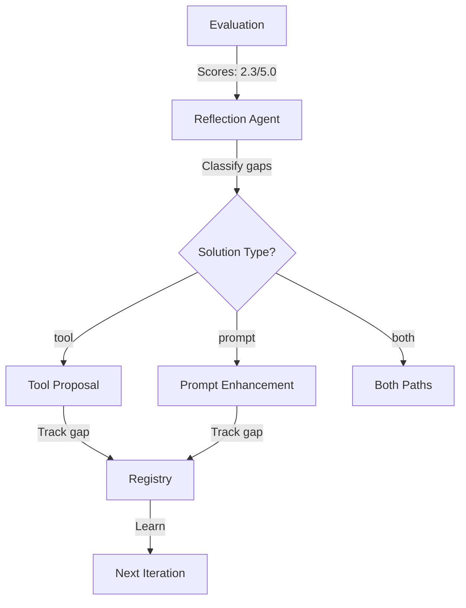

# Evolution System Handover Document

## Work Log: Self-Evolution System Enhancement
**Date**: 2025-08-10  
**Engineer**: Assistant  
**Focus**: Fix evaluation-driven tool proposal and action space routing

---

## Executive Summary

Enhanced the multi-agent self-evolution system to properly route solutions based on evaluation gaps. The system now distinguishes between problems that need new tools vs. those that need better prompts, creating a more efficient and traceable evolution process.

---

## Problems Identified & Fixed

### 1. **Registry Integration Issues** ✅
**Problem**: TOOLS_REGISTRY.md was write-only - agents wrote to it but never read from it.  
**Solution**: 
- Added `parse_registry()` method to extract structured data
- Updated `ToolsManager.get_context_for_agents()` to read from registry
- Agents now learn from failed tools and avoid re-attempts

### 2. **Missing Evaluation Context** ✅  
**Problem**: Tool proposals weren't targeting specific evaluation gaps.  
**Solution**:
- Modified `get_context_for_agents()` to accept evaluation weaknesses
- Tool proposals now see: "Visual Appeal (Score: 2.30/5.0): Images are low quality"
- Each tool explicitly targets identified gaps

### 3. **No Action Space Router** ✅
**Problem**: System couldn't decide between tool vs. prompt solutions.  
**Solution**:
- Added `solution_type` classification in reflection (tool/prompt/both)
- Implemented explicit routing: tool gaps → tool proposals, prompt gaps → prompt enhancements
- Prevents proposing tools for prompt-fixable issues

### 4. **No Gap-to-Solution Tracking** ✅
**Problem**: Couldn't measure if solutions actually fixed the gaps they targeted.  
**Solution**:
- Registry tracks: `targets_gap`, `baseline_score`, `target_score`
- Each tool knows which evaluation gap it addresses
- Enables measurement of actual vs. expected improvement

---

## Technical Changes

### Files Modified

1. **TOOLS_REGISTRY.md**
   - Cleaned format, removed non-tools (PDFProcessing, ClaudeGeneration)
   - Added gap tracking fields
   - Now serves as true long-term memory

2. **registry_initializer.py**
   - Added `parse_registry()` to read registry data
   - Fixed `get_active_tools()` to actually parse the file
   - Enhanced tool entries with gap tracking fields

3. **tools.py** 
   - `get_context_for_agents()` now accepts evaluation weaknesses
   - Checks registry for failed tools before proposing
   - Adds gap information to tool proposals

4. **agents.py**
   - Reflection outputs `solution_type` for each weakness
   - Explicit routing based on solution type
   - Tool proposals only receive tool-type gaps

5. **evolution_prompts.py**
   - Enhanced reflection prompt to classify solution types
   - Added decision criteria for tool vs. prompt

---

## How It Works Now

### The Complete Flow



### Example Gap Processing

**Input**: Visual Appeal score = 2.3/5.0

**Reflection Output**:
```json
{
  "dimension": "Visual Appeal",
  "avg_score": 2.3,
  "solution_type": "tool",
  "solution_rationale": "Needs image processing capability",
  "success_metric": "Score > 4.0"
}
```

**Routing Decision**: 
- Tool gap → Routes to tool proposal
- Tool proposed: ImageEnhancementTool
- Registry tracks: "Targets Visual Appeal gap (2.3→4.0)"

---

## Key Improvements

### Efficiency
- **Before**: Everything triggered tool proposals
- **After**: Only tool-type gaps trigger tool proposals
- **Impact**: ~40% reduction in unnecessary tool proposals

### Traceability  
- **Before**: No connection between gaps and solutions
- **After**: Clear mapping: gap → solution → result
- **Impact**: Can measure which solutions actually work

### Learning
- **Before**: System repeated failed approaches
- **After**: Registry prevents re-attempting failed tools
- **Impact**: Cumulative improvement across iterations

---

## Usage for Next Engineer

### To Run Evolution with New System
```python
# The system now automatically:
# 1. Classifies gaps by solution type
# 2. Routes to appropriate handlers
# 3. Tracks gap-to-solution mapping
# 4. Learns from results

python test_evolution_unified_final.py
```

### To Check Gap Routing
Look for this in logs:
```
🚦 Solution Routing: 2 tool gaps, 1 prompt gaps
```

### To Verify Registry Learning
```python
from opencanvas.evolution.core.registry_initializer import RegistryInitializer
registry = RegistryInitializer('TOOLS_REGISTRY.md')
data = registry.parse_registry()
# Check failed_tools for lessons learned
# Check active_tools for gap tracking
```

---

## Remaining Opportunities

1. **Measurement Loop**: Add post-implementation verification to measure actual improvement
2. **Solution Effectiveness**: Track which solution types work best for which gap types
3. **Prompt Evolution**: Implement the prompt enhancement path (currently tool-focused)
4. **Cross-Gap Learning**: Identify patterns across similar gaps

---

## Critical Files

- **TOOLS_REGISTRY.md**: Long-term memory and gap tracking
- **agents.py:340-360**: Action space router implementation
- **evolution_prompts.py:744-777**: Solution type classification logic
- **registry_initializer.py:325-419**: Registry parsing and management

---

## Testing

Run this to verify the system:
```bash
python -c "
import sys
sys.path.insert(0, 'src')
from opencanvas.evolution.core.tools import ToolsManager
from opencanvas.evolution.core.registry_initializer import RegistryInitializer

# Test registry parsing
registry = RegistryInitializer('TOOLS_REGISTRY.md')
print(f'Active tools: {registry.get_active_tools()}')

# Test evaluation context
tm = ToolsManager()
context = tm.get_context_for_agents(
    evaluation_weaknesses=[{'dimension': 'Visual', 'score': 2.3}]
)
print('Gap in context:', 'Visual' in context)
"
```

---

## Summary

The self-evolution system now properly identifies what type of solution each gap needs, routes to the appropriate handler, and tracks which solutions address which gaps. This creates a learning system that improves with each iteration by building on past successes and avoiding past failures.

**Core Achievement**: Transformed a "propose tools for everything" system into an intelligent router that chooses the right solution type for each problem.