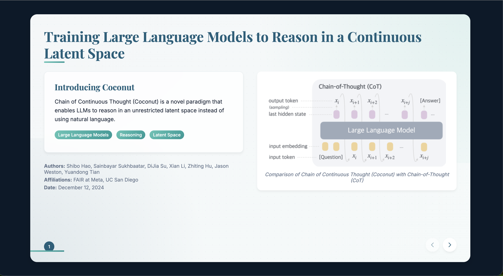

# OpenCanvas

[](https://www.python.org/downloads/)
[](https://opensource.org/licenses/MIT)

> AI-powered presentation generation system that creates beautiful HTML slide decks from topics or PDF documents, with automatic quality evaluation and continuous improvement.

## ✨ Features

- 🎨 **Dual Input Support** - Generate from text topics or PDF documents
- 🔍 **Smart Research** - Automatic web research when knowledge is insufficient
- 📊 **AI Evaluation** - Comprehensive quality assessment with Claude, GPT, or Gemini
- 🎯 **Multiple Themes** - Professional themes for different presentation contexts
- 🔄 **HTML to PDF** - High-quality PDF conversion with customizable zoom
- 📁 **Organized Output** - Structured folders with timestamps and source tracking
- 🚀 **REST API** - Full RESTful interface for programmatic access
- 🤖 **Self-Evolution** - Autonomous system that improves presentation quality over time

<div align="center">



**Example presentation generated from:** *Training Large Language Models to Reason in a Continuous Latent Space https://arxiv.org/pdf/2412.06769*

</div>
## 🚀 Quick Start

### Installation

```bash
git clone https://github.com/genmini-ai/OpenCanvas.git
cd OpenCanvas
pip install -e .
playwright install chromium
```

### Configuration

```bash
cp .env.example .env
# Edit .env with your API keys
```

Required: `ANTHROPIC_API_KEY` (get from [console.anthropic.com](https://console.anthropic.com/))
Optional: `BRAVE_API_KEY`, `GEMINI_API_KEY`, `OPENAI_API_KEY`

### Generate Your First Presentation

```bash
# From a topic
opencanvas generate "AI in healthcare" --purpose "academic presentation"

# From a PDF
opencanvas generate "https://arxiv.org/pdf/2505.20286" --purpose "research seminar"

# Full pipeline (generate + convert + evaluate)
opencanvas pipeline "quantum computing" --purpose "conference talk" --evaluate
```

## 📖 Usage

### CLI Commands

#### Generate
```bash
# Topic-based generation
opencanvas generate "sustainable energy solutions" \
  --purpose "corporate presentation" \
  --theme "natural earth"

# PDF-based generation (images extracted by default)
opencanvas generate "paper.pdf" --purpose "conference presentation"

# Disable image extraction
opencanvas generate "paper.pdf" --no-extract-images
```

#### Convert to PDF
```bash
opencanvas convert output/slides.html \
  --output presentation.pdf \
  --zoom 1.5
```

#### Evaluate Quality
```bash
opencanvas evaluate evaluation_folder/
```

#### Complete Pipeline
```bash
opencanvas pipeline "machine learning ethics" \
  --purpose "academic seminar" \
  --evaluate \
  --zoom 1.3
```

### API Usage

Start the API server:
```bash
opencanvas api --host 0.0.0.0 --port 8000
```

Make requests:
```bash
curl -X POST "http://localhost:8000/api/v1/generate" \
  -H "Content-Type: application/json" \
  -d '{
    "input_source": "AI in healthcare",
    "purpose": "academic presentation",
    "theme": "professional blue"
  }'
```

**Documentation:** [http://localhost:8000/docs](http://localhost:8000/docs)
**Full API Guide:** [API_README.md](API_README.md)

## 📁 Output Structure

OpenCanvas creates organized directories for all outputs:

```
output/
└── quantum_computing_20241128_120000/
    ├── slides/
    │   ├── quantum_computing_slides.html
    │   └── quantum_computing_presentation.pdf
    ├── evaluation/
    │   └── quantum_computing_evaluation.json
    └── sources/
        ├── source_content.txt          # For topic-based
        └── source.pdf                  # For PDF-based
```

## ⚙️ Configuration

### Environment Variables

| Variable | Required | Default | Description |
|----------|----------|---------|-------------|
| `ANTHROPIC_API_KEY` | ✅ | - | Claude API key (generation) |
| `BRAVE_API_KEY` | ❌ | - | Web search API key |
| `GEMINI_API_KEY` | ❌ | - | Gemini API key (evaluation) |
| `OPENAI_API_KEY` | ❌ | - | OpenAI API key (evaluation) |
| `EVALUATION_PROVIDER` | ❌ | `gemini` | `claude`, `gpt`, or `gemini` |
| `EVALUATION_MODEL` | ❌ | `gemini-2.5-flash` | Model for evaluation |
| `DEFAULT_THEME` | ❌ | `professional blue` | Presentation theme |
| `DEFAULT_ZOOM` | ❌ | `1.2` | PDF zoom factor |

### Available Themes

- `professional blue` - Clean corporate design
- `clean minimalist` - Simple elegant layout
- `natural earth` - Warm earth tones
- `modern contemporary` - Trendy cutting-edge
- `warm earth tones` - Cozy approachable
- `bold high contrast` - High-impact design

Full list: See [themes.py](src/opencanvas/shared/themes.py)

## 🧪 Testing

```bash
# Run full test suite
python run_tests.py

# Light mode (faster)
python run_tests.py light

# Specific tests
python run_tests.py topic  # Topic generation only
python run_tests.py pdf    # PDF generation only
```

## 🤖 Evolution System

OpenCanvas includes an autonomous improvement system that learns from evaluation results:

```bash
# Run evolution cycle
opencanvas evolve --max-iterations 3 --improvement-threshold 0.15
```

The system automatically:
- Evaluates presentation quality
- Identifies improvement opportunities
- Evolves prompts and generates new tools
- Tracks performance improvements

**Learn more:** [docs/architecture/evolution-system.md](docs/architecture/evolution-system.md)

## 📚 Documentation

- **[Installation Guide](docs/installation.md)** - Detailed setup instructions
- **[CLI Reference](docs/usage/cli.md)** - Complete command reference
- **[API Guide](API_README.md)** - REST API documentation
- **[Architecture](docs/architecture/overview.md)** - System design
- **[Contributing](CONTRIBUTING.md)** - How to contribute
- **[Examples](examples/)** - Usage examples

## 🔧 Troubleshooting

### Common Issues

**"opencanvas command not found"**
```bash
pip install -e .
which opencanvas
```

**"ANTHROPIC_API_KEY is required"**
```bash
cat .env | grep ANTHROPIC_API_KEY
```

**Playwright not available**
```bash
playwright install chromium
# Or use selenium
opencanvas convert slides.html --method selenium
```

**Web research not working**
```bash
# Add BRAVE_API_KEY to .env for web research
# Without it, generation uses only Claude's knowledge
```

More troubleshooting: [docs/troubleshooting.md](docs/troubleshooting.md)

## 🤝 Contributing

We welcome contributions! Please see [CONTRIBUTING.md](CONTRIBUTING.md) for guidelines.

### Development Setup

```bash
git clone https://github.com/genmini-ai/OpenCanvas.git
cd OpenCanvas
pip install -r requirements-all.txt
playwright install chromium
```

### Running Tests

```bash
python run_tests.py
pytest tests/
```

## 📄 License

This project is licensed under the MIT License - see the [LICENSE](LICENSE) file for details.

## 🙏 Acknowledgments

Built with:
- [Anthropic Claude](https://www.anthropic.com/) - AI generation
- [Playwright](https://playwright.dev/) - Browser automation
- [FastAPI](https://fastapi.tiangolo.com/) - REST API framework
- [Brave Search](https://brave.com/search/api/) - Web research

---

**Star this repo** if you find it useful! ⭐
