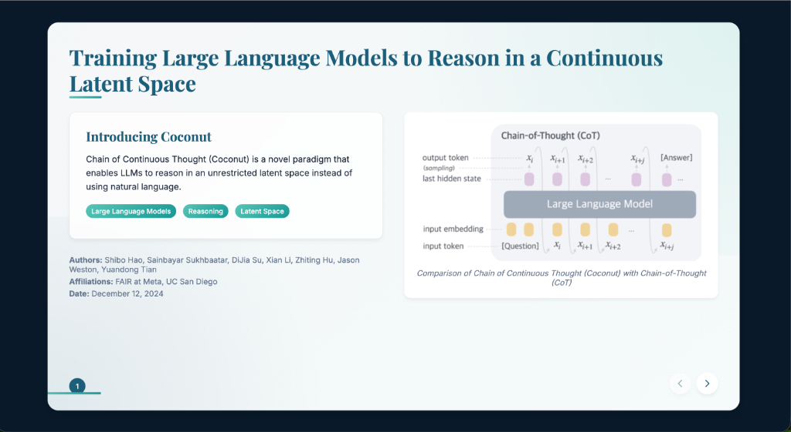
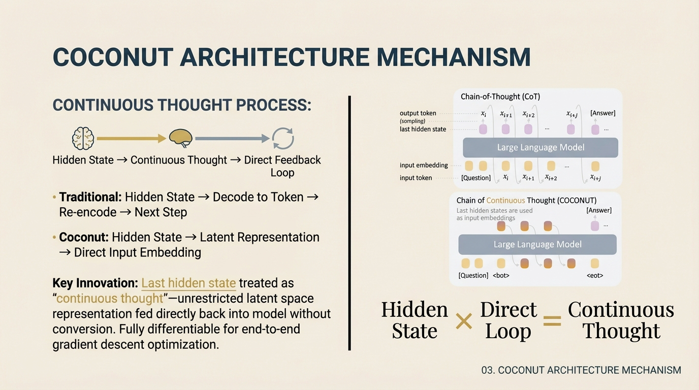

# OpenCanvas

[](https://www.python.org/downloads/)
[](https://opensource.org/licenses/MIT)

> AI-powered presentation generation from topics or PDFs. Beautiful slides in minutes, not hours.

## ✨ Key Features

- 🎨 **Dual Output Modes** - HTML slides or PNG images with Gemini AI
- 📄 **Flexible Input** - Generate from topics or PDF documents
- 🎯 **Smart Figure Matching** - Auto-extracts and matches figures to slides (Image mode + PDF)
- 📊 **Quality Evaluation** - AI-powered assessment and improvement
- 🚀 **REST API** - Full programmatic access

<div align="center">



**Example presentation generated from:** *Training Large Language Models to Reason in a Continuous Latent Space https://arxiv.org/pdf/2412.06769*

</div>
## 🚀 Quick Start

### Installation

```bash
git clone https://github.com/genmini-ai/OpenCanvas.git
cd OpenCanvas
pip install -e .
```

### Setup

```bash
cp .env.example .env
# Add your ANTHROPIC_API_KEY (required for both modes)
# Add your GEMINI_API_KEY (required for Image mode)
```

Get API keys:
- Anthropic: [console.anthropic.com](https://console.anthropic.com/)
- Gemini: [aistudio.google.com](https://aistudio.google.com/)

### Generate Your First Presentation

**🔥 Image Mode (PNG slides with AI-generated visuals)**
```bash
# From a topic
opencanvas generate "quantum computing" \
  --output-format image \
  --purpose "conference talk"

# From a PDF (with automatic figure extraction & matching)
opencanvas generate "https://arxiv.org/pdf/2412.06769" \
  --output-format image \
  --purpose "research seminar"
```


*Image mode: AI-generated slide with automatically extracted and matched figures from research paper*

**HTML Mode (Default)**
```bash
# From a topic
opencanvas generate "AI in healthcare" --purpose "academic presentation"

# From a PDF
opencanvas generate "https://arxiv.org/pdf/2412.06769" --purpose "research seminar"
```

## 📖 Output Modes

### HTML Mode
- **Output**: Single HTML file with embedded styles
- **Best for**: Quick presentations, web sharing, easy editing
- **Features**: Clean layouts, multiple themes, fast generation
- **Convert to PDF**: `opencanvas convert slides.html`

### Image Mode
- **Output**: Individual PNG slides + compiled PDF
- **Best for**: High-quality visuals, research presentations with figures
- **Features**: AI-generated designs, automatic figure extraction from PDFs, intelligent figure-to-slide matching
- **Time**: ~3 minutes for 10-12 slides
- **Requires**: `GEMINI_API_KEY`

**[Learn more about Image Mode →](docs/usage/image-generation.md)**

## 📁 Output Structure

**HTML Mode:**
```
output/topic_20241213_225914/
├── slides/
│   └── slides.html          # Single HTML file
└── sources/
    └── source_content.txt
```

**Image Mode:**
```
output/topic_20241213_225914/
├── slides/
│   ├── slide_001.png
│   ├── slide_002.png
│   └── ...
├── extracted_images/        # (PDF input only)
│   ├── figure_1.png
│   └── figure_captions.json
├── sources/
│   ├── blog_content.txt
│   └── slide_blueprints.json
└── presentation.pdf         # Auto-compiled
```

## 📚 Documentation

- **[Installation Guide](docs/installation.md)** - Detailed setup
- **[CLI Reference](docs/usage/cli.md)** - All commands
- **[Image Mode Guide](docs/usage/image-generation.md)** - Figure matching & PNG slides
- **[API Guide](API_README.md)** - REST API
- **[Evolution System](docs/architecture/evolution-system.md)** - Auto-improvement

## 🎯 Common Use Cases

```bash
# HTML: Quick presentation from topic
opencanvas generate "machine learning basics" --purpose "lecture"

# HTML: Research paper to slides
opencanvas generate "paper.pdf" --purpose "seminar"

# Image: High-quality presentation with figures
opencanvas generate "paper.pdf" \
  --output-format image \
  --purpose "conference talk"

# Complete pipeline with evaluation
opencanvas pipeline "research topic" --purpose "conference" --evaluate
```

## 🤝 Contributing

We welcome contributions! See [CONTRIBUTING.md](CONTRIBUTING.md) for guidelines.

```bash
# Development setup
git clone https://github.com/genmini-ai/OpenCanvas.git
cd OpenCanvas
pip install -r requirements-all.txt
python run_tests.py
```

## 📄 License

MIT License - see [LICENSE](LICENSE) file for details.

## 🙏 Built With

- [Anthropic Claude](https://www.anthropic.com/) - AI generation
- [Google Gemini](https://ai.google.dev/) - Image generation
- [Docling](https://github.com/DS4SD/docling) - Figure extraction
- [FastAPI](https://fastapi.tiangolo.com/) - REST API

---

**⭐ Star this repo** if you find it useful!

**📚 [Full Documentation](docs/)** | **🐛 [Report Issues](https://github.com/genmini-ai/OpenCanvas/issues)** | **💬 [Discussions](https://github.com/genmini-ai/OpenCanvas/discussions)**
